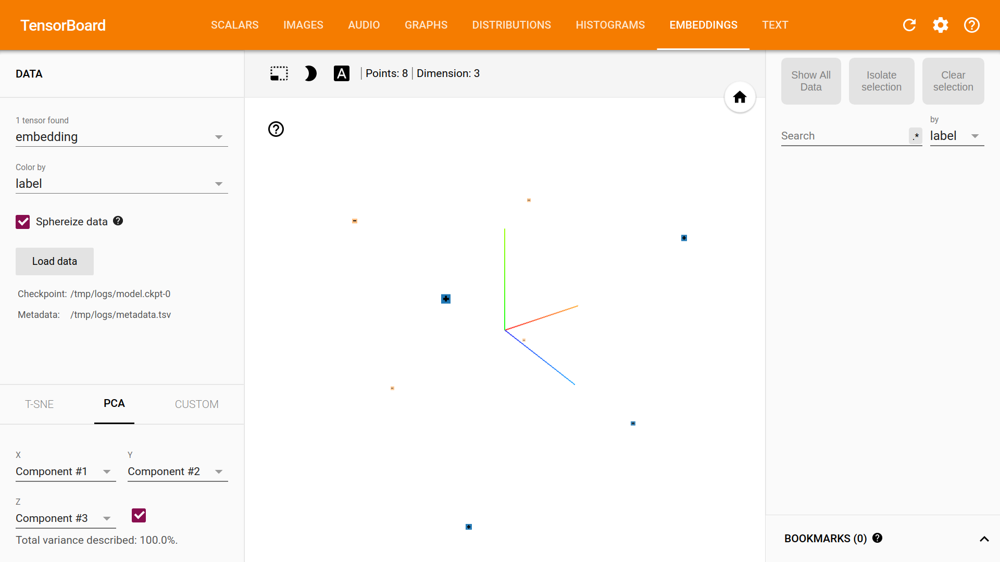

# TensorFlow Embeddings: Minimalistic Example

This code is a minimalistic example of how to use TensorBoard visualization
of embeddings saved in a TensorFlow session.

The only dependency to run this example is to have docker installed.

To run the example simply execute the `run.sh` script. Then, to view
the visualization of the embeddings go to http://localhost:6006/#embeddings

